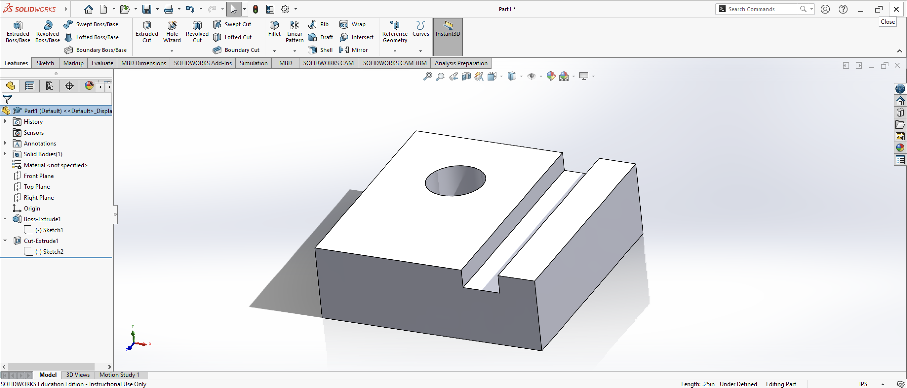
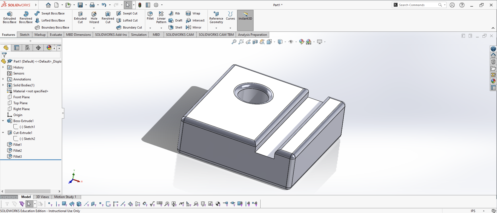

# SolidWorks Practice Model 1

This project was one of my introductory SolidWorks modeling exercises. The objective was to create a 3D solid model from a dimensioned reference drawing and then use the completed model to produce a detailed 2D engineering drawing containing Front, Top, and Right views. All dimensions for the part were provided in inches.

The main body of the part measures 3.00 × 3.00 × 1.00 inches. I began by creating a 2D sketch for the basic rectangular shape and used Smart Dimension to define its measurements. I then used Extruded Boss/Base to turn the sketch into the main 3D solid.

The next major feature was the recessed channel running along one side of the part. Using another sketch, I positioned and dimensioned the channel according to the reference drawing. The channel includes 0.50-inch sections and extends 0.25 inches into the part. I then used Extruded Cut to remove the required material and form the recessed geometry.

Another important feature was the 0.75-inch diameter hole. The center of the hole needed to be positioned exactly 1.00 inch from two edges of the part. To locate it accurately, I created a temporary 1.00 × 1.00-inch square from the corner of the model. The corner of this temporary geometry provided the exact location for the center of the circle. After creating and positioning the circle, I deleted the temporary square and used the circle to create the hole with an Extruded Cut.

After completing the 3D model, I created a SolidWorks drawing sheet to communicate the geometry of the finished part. The drawing contains Front, Top, and Right orthographic views along with the necessary dimensions, hidden lines, centerlines, center marks, diameter notation, drawing scale, default tolerances, and title block information.

This exercise gave me practice interpreting a dimensioned reference, planning how individual features could be constructed, accurately positioning geometry, creating a 3D model, and translating the finished model into a technical engineering drawing. It also helped me become more familiar with the feature-based modeling workflow used in SolidWorks.

## Engineering Drawing Sheet

After completing the 3D model, I created a new SolidWorks drawing
sheet to produce a technical drawing of the finished part. I inserted
the completed model into the drawing and generated the required
Front, Top, and Right orthographic views.

I positioned the three views on the sheet so that the geometry of the
part could be clearly understood from multiple directions. I then
added the required dimensions to communicate the size and location
of the major features, including the overall dimensions, recessed
channel, and 0.75-inch diameter hole.

The drawing also required me to work with center marks, centerlines,
hidden lines, dimension placement, and the drawing title block. This
part of the exercise helped me understand that creating the 3D model
is only one part of the CAD process. The finished design also needs
to be communicated clearly through an engineering drawing.

### Completed Drawing

### Completed Model

### Additional Practice – Fillet Feature

After completing the original model, I decided to experiment further
with SolidWorks by applying fillets to several edges of the part.

The original exercise used sharp edges throughout the model. For
additional practice, I used the Fillet feature to round selected edges
around the exterior of the part, the recessed channel, and the circular
opening. I created multiple fillet features so that I could practice
selecting different groups of edges and observe how the geometry
changed after each operation.

This modification was not required for the original exercise. I added
it as additional practice to become more familiar with modifying an
existing model and using the Fillet feature.

