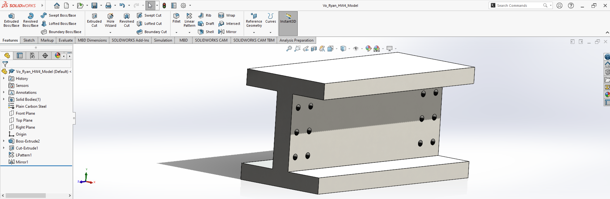

# SolidWorks Practice Model 2

## Introduction

This project is my second documented SolidWorks practice model. The objective was to create a 3D model of a W14×370 wide-flange steel beam based on a textbook exercise and then modify the beam by adding a series of holes using the Linear Pattern and Mirror features.

Compared to my first SolidWorks model, this exercise introduced additional modeling techniques, particularly the use of repeated features and symmetrical geometry. It also gave me more practice working with dimensional constraints, creating sketches, and modifying an existing solid model.

## Creating the Wide-Flange Beam

I began by creating a 2D sketch of the beam's cross-section using the dimensions provided in the textbook. The beam has an overall width of 16.475 inches and a height of 17.920 inches, with a flange thickness of 2.660 inches and a web thickness of 1.655 inches.

To construct the cross-section, I used sketching tools and dimensional constraints to define the geometry. I also practiced using centerlines and the Mirror Entities tool to create the symmetrical portions of the beam.

Once the cross-section was completed, I used Extruded Boss/Base to create a 36-inch-long beam segment. I then assigned Plain Carbon Steel as the material.

## Creating the Holes

The next objective was to modify the original beam by adding six 1.00-inch-diameter holes near each end of the web, for a total of twelve holes.

I began by creating a sketch on the web of the beam and positioning the first circular hole according to the reference drawing. The hole was dimensioned to have a diameter of 1.00 inch and positioned using the measurements provided in the exercise.

After completing the sketch, I used Extruded Cut to create the first hole through the web.

## Linear Pattern and Mirror

Instead of manually sketching and cutting each additional hole, I used the Linear Pattern feature to duplicate the original hole and create the required arrangement.

The holes were arranged in two columns and three rows near one end of the beam. The horizontal spacing between the two columns was 3.00 inches, while the vertical spacing between the rows was 4.00 inches.

Once the first group of six holes was completed, I used the Mirror feature to reproduce the same arrangement at the opposite end of the beam.

Using these features allowed me to practice creating repeated geometry while maintaining consistent spacing and symmetry throughout the model.

## Completed 3D Model

The completed model is shown below in an isometric view. The screenshot also displays the SolidWorks FeatureManager tree, including the Extruded Boss/Base, Extruded Cut, Linear Pattern, and Mirror features used during construction.

## What I Learned

This exercise helped me become more familiar with constructing symmetrical geometry, creating precise sketches, and using feature-based modeling techniques.

One of the most important skills I practiced was using Linear Pattern and Mirror to reproduce existing features instead of creating each one individually. These tools made it easier to maintain consistent dimensions and create symmetrical arrangements of holes.

Compared to my first SolidWorks exercise, this project expanded my understanding of how more complex mechanical parts can be constructed and modified using a combination of sketches, extrusions, patterns, and mirrored features.

## Reference

This model was based on textbook exercises P3.2 and P3.3, with additional guidance from the following SolidWorks tutorial:

[SolidWorks Tutorial – YouTube](https://www.youtube.com/watch?v=GlqO7N8qYSw)
  
