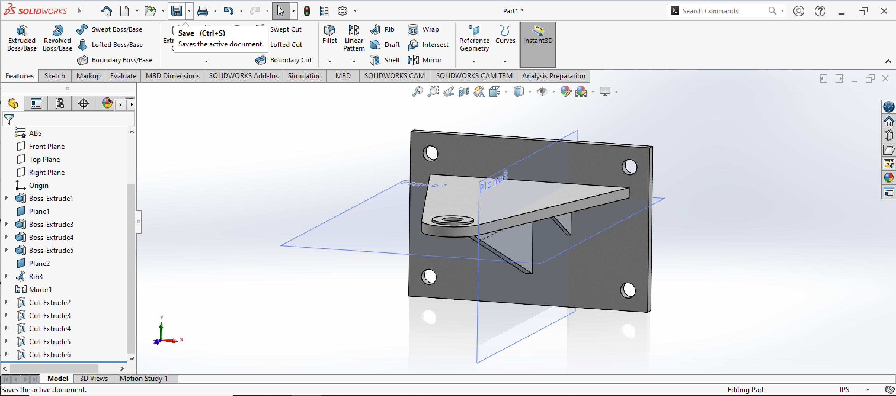

# SolidWorks Practice Model 3

## Introduction

This project is my third documented SolidWorks practice model. The objective was to create a 3D model of a mechanical bracket based on Section 3.2, "Bracket," from Chapter 3 of Introduction to Solid Modeling.

Compared to my previous SolidWorks models, this exercise introduced more practice with reference planes, ribs, mirrored features, patterned holes, and engineering drawings. It also required me to think more carefully about where sketches needed to be created and how existing features could be reused instead of modeled again from scratch.

## Creating the Main Bracket

I began by creating the rectangular back plate of the bracket using a 2D sketch and Extruded Boss/Base. The mounting plate is 5.00 inches wide and 6.00 inches high, with a thickness of 0.25 inch. I used Smart Dimension to define the sketch according to the dimensions provided in the textbook.
I then created the horizontal projecting portion of the bracket. From the side view, the bracket extends 5.50 inches from the mounting plate. The projecting plate has a thickness of 0.25 inch and terminates in a rounded end with a radius of 0.75 inch.

The back plate contains four mounting holes, each with a diameter of 0.38 inch. After creating the first hole with Extruded Cut, I used Linear Pattern rather than manually recreating the remaining holes. The pattern used a horizontal spacing of 5.00 inches and a vertical spacing of 3.00 inches, producing the four-hole arrangement shown in the completed model.

## Creating the Holes

One of the more challenging parts of this model was creating the small reinforcing ribs underneath the projecting plate.

The default Front, Top, and Right planes were not positioned where I needed to create the rib geometry, so l created an additional reference plane. This gave me a suitable location to create the sketch used for the reinforcement.

After creating the required sketch, I used the Rib feature to form the small structural support underneath the bracket.

Instead of manually creating another rib on the opposite side, l used the Mirror feature to duplicate the existing rib. This allowed both ribs to remain consistent while avoiding the need to recreate the same
geometry a second time.

## Creating the Rounded Hole

At the rounded end of the bracket, I created a circular sketch centered on the reinforced area. I used Smart Dimension to set the required diameter and make sure the circle was correctly positioned.

I then used Extruded Cut with the Through All option to create the hole completely through the bracket.

Smart Dimension was particularly useful during this part of the project because it allowed me to correct the geometry when dimensions or positions needed adjustment.

## Creating the Mounting Holes

The rectangular back plate required four mounting holes. Instead of creating all four holes individually, I first created and dimensioned one hole near a corner of the plate.

After creating the first hole with Extruded Cut, I used the Linear Pattern feature to reproduce it across the mounting plate.

For Direction 1, I selected the top horizontal edge of the rectangular plate and set the spacing to 5.00 inches with 2 instances. For Direction 2, I selected a vertical edge and set the spacing to 3.00 inches with 2 instances.

Using two pattern directions produced the four-hole arrangement while keeping the spacing consistent.

## Creating the Engineering Drawing

After completing the 3D model, I created a SolidWorks drawing sheet for the bracket.

I inserted multiple orthographic views so the different parts of the bracket could be seen clearly, including the mounting plate, projecting arm, ribs, rounded end, and holes.

I then used Model Items from the Annotation tab to import dimensions from the 3D model into the drawing. Smart Dimension was also useful for displaying or correcting dimensions where necessary.

The drawing was completed using my Cal Poly Pomona Engineering Labs title block.

## Completed 3D Model

The completed model is shown below in an isometric view. The screenshot also displays the SolidWorks FeatureManager tree and the reference planes used during construction.

## What I Learned

This exercise helped me become more comfortable using reference geometry and feature-based modeling techniques in SolidWorks. One of the most important skills I practiced was creating an additional reference plane when the default planes were not suitable for a feature. This was necessary when creating the reinforcing rib underneath the bracket.

I also gained more experience using Mirror and Linear Pattern to reproduce existing geometry instead of rebuilding the same features manually. Mirroring the rib saved time and kept the reinforcement symmetrical, while the Linear Pattern made it much easier to create the four mounting holes with consistent spacing.

Smart Dimension was another important tool throughout the project because I used it to control and correct the dimensions of sketches and features.

Compared to my previous SolidWorks exercises, this model required me to combine more tools in a single part, including Extruded Boss/Base, reference planes, Rib, Mirror, Extruded Cut, Linear Pattern, Smart Dimension, and drawing tools.

## What I Learned

This exercise helped me become more familiar with constructing symmetrical geometry, creating precise sketches, and using feature-based modeling techniques.

One of the most important skills I practiced was using Linear Pattern and Mirror to reproduce existing features instead of creating each one individually. These tools made it easier to maintain consistent dimensions and create symmetrical arrangements of holes.

Compared to my first SolidWorks exercise, this project expanded my understanding of how more complex mechanical parts can be constructed and modified using a combination of sketches, extrusions, patterns, and mirrored features.

## Reference

This model was based on Section 3.2, "Bracket," from Chapter 3 of Introduction to Solid Modeling.
  
