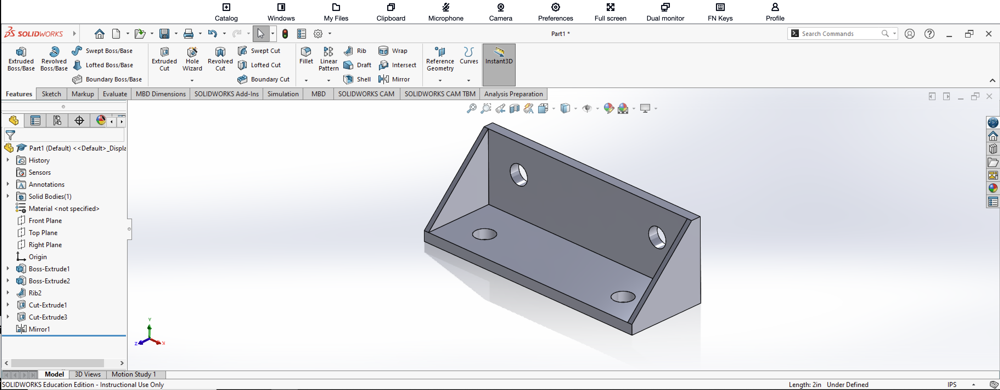

# SolidWorks Practice Model 4

## Introduction

This project is my fourth documented SolidWorks practice model. The objective was to create a reinforced angle bracket using several SolidWorks features, including Extruded Boss/Base, Rib, Extruded Cut, Mirror, and Smart Dimension.

This exercise gave me additional practice creating a mechanical part from multiple sketches and features. Compared to some of my previous models, this part required me to create reinforcing ribs between two perpendicular plates and use symmetry to avoid recreating identical geometry manually.

## Creating the Main Bracket

I began by creating the basic L-shaped structure of the bracket using sketches and Extruded Boss/Base.

The bracket consists of a horizontal base plate and a vertical back plate positioned perpendicular to each other. I used Smart Dimension throughout the sketches to define the geometry according to the dimensions provided in the reference drawing.

The reference drawing included dimensions such as 2.00 inches, 1.00 inch, 0.50 inch, and 0.125 inch for different portions of the bracket.

## Creating the Reinforcing Rib

One of the main new features I practiced in this model was the Rib tool.

I created a sketch for the triangular reinforcing support between the horizontal and vertical portions of the bracket. I then used the Rib feature to convert the sketch into a solid reinforcing rib.

The side view of the reference drawing shows the rib extending diagonally between the horizontal base and vertical back plate. This creates the triangular support visible on the completed model.

## Mirroring the Rib

Because the bracket uses symmetrical reinforcing ribs, I did not need to construct the second rib manually.

After creating the first rib, I used the Mirror feature and selected the appropriate center plane as the mirror plane. I selected the rib as the feature to mirror, which created an identical rib on the opposite side of the bracket.

Using Mirror allowed me to maintain symmetry while reducing the amount of repeated sketching and modeling required.

## Creating the Holes

I also created holes in both the horizontal and vertical portions of the bracket.

I created circular sketches and used Smart Dimension to control the diameter and location of the holes. After defining the sketches, I used Extruded Cut to cut the holes through the appropriate plates.

The reference drawing specifies two holes on the horizontal portion and two holes on the vertical portion of the bracket.

Some dimensions in the reference drawing are displayed using two decimal places. For example, a dimension shown as 0.38 inch can correspond to a more precise model dimension of 0.375 inch when rounded to two decimal places.

## Using Mirror for Repeated Features

In addition to creating the second reinforcing rib, I practiced using the Mirror feature to reproduce symmetrical features of the model.

I selected the Right Plane as the mirror plane and selected the appropriate Rib and Extruded Cut features under Features to Mirror.

This allowed the corresponding geometry to be reproduced on the opposite side of the model without manually recreating each feature.

## Completed 3D Model

The completed bracket is shown below in an isometric view. The SolidWorks FeatureManager tree also shows several of the features used to construct the model, including Boss-Extrude, Rib, Cut-Extrude, and Mirror.

## What I Learned

This exercise gave me more experience constructing a part from several individual SolidWorks features instead of relying on a single sketch and extrusion.

One of the most important skills I practiced was creating reinforcing geometry using the Rib tool. I also gained additional experience using reference planes and the Mirror feature to create symmetrical geometry.

Smart Dimension was important throughout the exercise because it allowed me to accurately control the sizes and positions of the sketches and holes according to the reference drawing.

I also learned that the displayed precision of a dimension can affect how a measurement appears. For example, a model dimension of 0.375 inch may be displayed as 0.38 inch when the drawing is configured to show two decimal places.

Overall, this project helped me become more comfortable combining Boss-Extrude, Rib, Extruded Cut, Mirror, and dimensional constraints to construct a complete mechanical part.

## Reference

This model was created with guidance from the following SolidWorks tutorial:

[SolidWorks Tutorial P3.4 Bracket – YouTube](https://www.youtube.com/watch?v=jbzACgB71pA)
